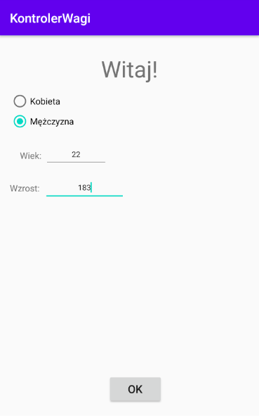
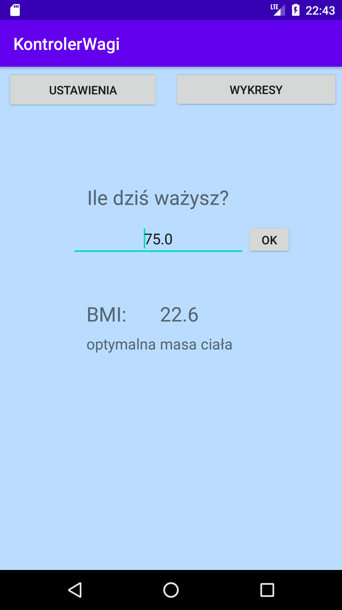
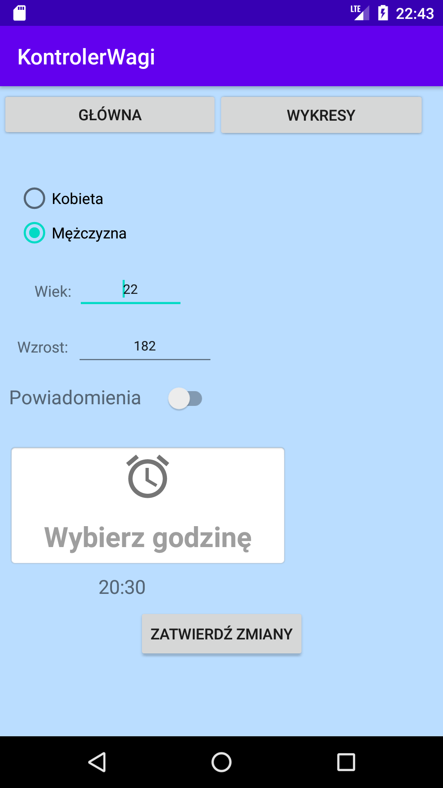
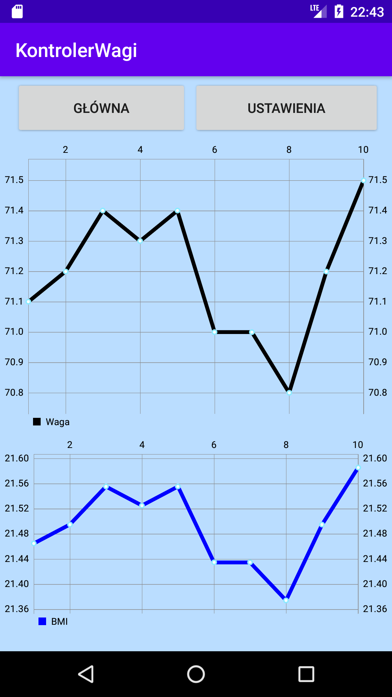

# KontrolerWagi
Aplikacja utworzona w ramach zajęć z Teleinformatycznych Systemów Mobilnych.  
Używając aplikacji można wspomagać kontrolę masy ciała.  
Aplikacja zawiera 4 ekrany:
1. widok startowy - pobranie od użytkownika wieku, płci i wzrostu, jest to ekran, który jest widoczny tylko przy pierwszym uruchomieniu
2. widok główny - umożliwia wpisanie ile waży w danym dniu użytkownik oraz wyświetla obliczony wskaźnik BMI
3. widok ustawień - umożliwia ustawienie dziennych powiadomień oraz zmianę informacji o użytkowniku (płeć, wiek, wzrost)
4. widok z wykresami - wykres liniowy zawiera dni miesiąca oraz wagę użytkownika w danym dniu. W widoku zamieszczono również wykres współczynnika BMI
## Wykorzystane technologie i narzędzia: 
1. Android Studio 4.0.1
2. Java
3. MPAndroidChart - biblioteka do rysowania wykresów, autor - Philipp Jahoda, 
bibliotekę można znaleźć pod adresem: https://github.com/PhilJay/MPAndroidChart

